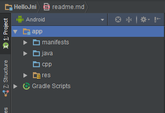
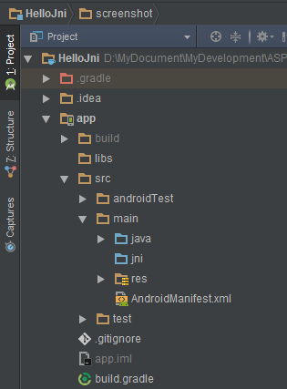
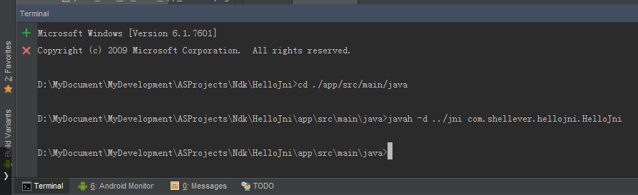
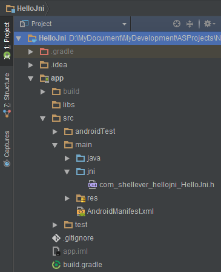
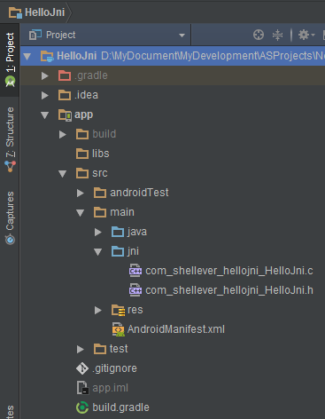
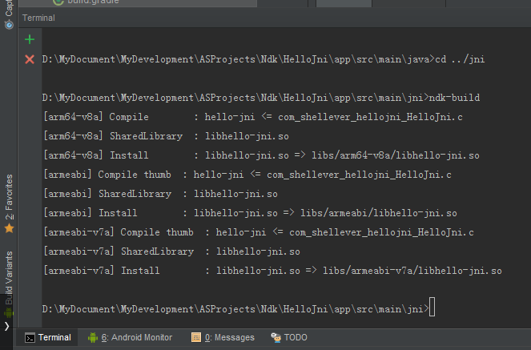
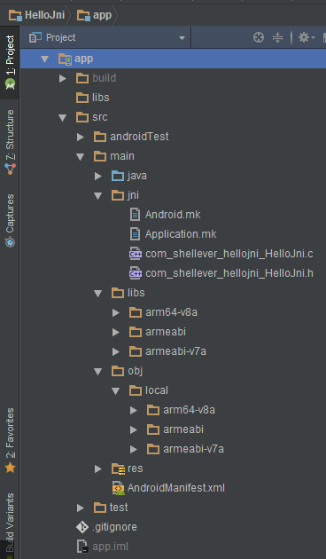

## HelloJni

#### 使用ndk-build命令手动配置生成so共享库

正确步骤：首先生成so共享库，然后再配置到当前工程模块中进行引用

说明：Android Studio 2.2 CMake只支持64位系统([stackflow中详细说明][stackflow])，所以只能使用ndk-build命令手动生成so共享库(自己32位电脑zaza，没办法)，CMake方式的可以查看文章后面提供的参考连接。

[stackflow]: http://stackoverflow.com/questions/37740147/how-to-install-the-android-studio-2-2-cmake-package-tool

#### 1. 使用`native`关键字来声明本地方法

HelloJni.java

```java
package com.shellever.hellojni;

public class HelloJni {

    // A native method that is implemented by the 'hello-jni' native library (libhello-jni.so)
    public native static String getStringFromJni();
}
```

#### 2. 使用JDK工具`javah`命令来自动创建头文件(.h)

2.1 切换工程面板为Android界面，选择app目录右键选择`/NEW/Folder/JNI Folder`来创建一个jni目录，此时会出现一个跟java同级的`cpp`目录



2.2 切换工程面板为Project界面，则会出现一个跟java同级的`jni`目录



2.3 使用javah命令来生成头文件的操作如下：

```
> cd ./app/src/main/java
> javah -d ../jni com.shellever.hellojni.HelloJni
```

命令终端Terminal中javah命令详细执行情况如下：



执行完javah命令后会在jni目录中生成.h头文件(`com_shellever_hellojni_HelloJni.h`)：



头文件内容如下：

```cpp
/* DO NOT EDIT THIS FILE - it is machine generated */
#include <jni.h>
/* Header for class com_shellever_hellojni_HelloJni */

#ifndef _Included_com_shellever_hellojni_HelloJni
#define _Included_com_shellever_hellojni_HelloJni
#ifdef __cplusplus
extern "C" {
#endif
/*
 * Class:     com_shellever_hellojni_HelloJni
 * Method:    getStringFromJni
 * Signature: ()Ljava/lang/String;
 */
JNIEXPORT jstring JNICALL Java_com_shellever_hellojni_HelloJni_getStringFromJni
  (JNIEnv *, jclass);

#ifdef __cplusplus
}
#endif
#endif

```

#### 3. 创建源文件并实现头文件中声明的方法(.c/.cpp)

切换工程面板至Project界面，并选中/app/src/main/jni目录，右键选择/NEW/`C/C++ Source File`来创建一个与头文件同名的.c源文件(或者.cpp源文件)



完整的源文件实现代码如下：

```cpp
//
// Created by shellever on 12/16/2016.
//

#include "com_shellever_hellojni_HelloJni.h"

// D:\MySoftware\MyDevelopment\Android\Sdk\ndk-bundle\platforms\android-17\arch-arm\usr\include\jni.h

JNIEXPORT jstring JNICALL Java_com_shellever_hellojni_HelloJni_getStringFromJni
  (JNIEnv *env, jclass clazz)
{
    // In C code
    return (*env)->NewStringUTF(env, "Hello from JNI!");

    // In C++ code
    // return env->NewStringUTF("Hello from JNI!");
}
```

#### 4. 编写mk编译文件

4.1 Android.mk

切换工程面板至Project界面，并选中`/app/src/main/jni`目录，右键选择`/NEW/File`来创建`Android.mk`编译文件，配置内容如下：

```
LOCAL_PATH := $(call my-dir)

include $(CLEAR_VARS)

LOCAL_MODULE    := hello-jni
LOCAL_SRC_FILES := com_shellever_hellojni_HelloJni.c

include $(BUILD_SHARED_LIBRARY)
```

4.2 Application.mk

切换工程面板至Project界面，并选中`/app/src/main/jni`目录，右键选择`/NEW/File`来创建`Application.mk`编译文件，配置内容如下：

```
# Define the target architecture to be ARM or other.
#APP_ABI := all
#APP_ABI := arm64-v8a armeabi armeabi-v7a mips mips64 x86 x86_64
APP_ABI := arm64-v8a armeabi armeabi-v7a
```

#### 5. 使用NDK工具`ndk-build`命令生成so共享库

使用ndk-build命令来生成头文件的操作如下：

```
> cd ../jni
> ndk-build
```

命令终端Terminal中ndk-build命令详细执行情况如下：



命令ndk-build执行成功后会生成与jni同级的`libs`和`obj`两个目录(可以手动删除掉obj目录)：



#### 6. 将so共享库配置到当前工程模块(app)中进行引用

在`/app/build.gradle`配置文件中配置ndk-build命令所生成的so共享库路径，当然也可以把生成的/app/src/main/libs目录下的文件拷贝到/app/libs目录下，这样就不再需要指定libs路径了。详细配置如下：

```
android {
    compileSdkVersion 23
    buildToolsVersion "23.0.3"
    defaultConfig {
        applicationId "com.shellever.hellojni"
        minSdkVersion 17
        targetSdkVersion 23
        versionCode 1
        versionName "1.0"
        testInstrumentationRunner "android.support.test.runner.AndroidJUnitRunner"

        // Specify the shared library
        sourceSets {
            main {
                // 1st step: MUST disable automatic ndk-build call
                jni.srcDirs = []

                // 2nd step: MUST specify the .so path (/app/src/main/libs)
                jniLibs.srcDirs = ['src/main/libs']     // Default: /app/libs
            }
        }
    }
    buildTypes {
        release {
            minifyEnabled false
            proguardFiles getDefaultProguardFile('proguard-android.txt'), 'proguard-rules.pro'
        }
    }
}
```

另一种libs路径配置方式：

```
// Config here
sourceSets.main {
    jni.srcDirs = []    // MUST disable automatic ndk-build call firstly
    jniLibs.srcDir "src/main/libs"      // MUST specify the .so path secondly
}
```

**7. 演示结果**


## Reference

**[Android Studio 2.2 更方便地创建JNI项目-CMake](http://www.jianshu.com/p/4eefb16d83e3)**

**[Getting Started with the NDK (Google Official)](https://developer.android.google.cn/ndk/guides/index.html)**

## Contacts

**Blog: [shellever](http://www.jianshu.com/users/22e9a407c7c1/latest_articles)**

**Email: shellever@163.com**

**Enjoy yourself. :)**